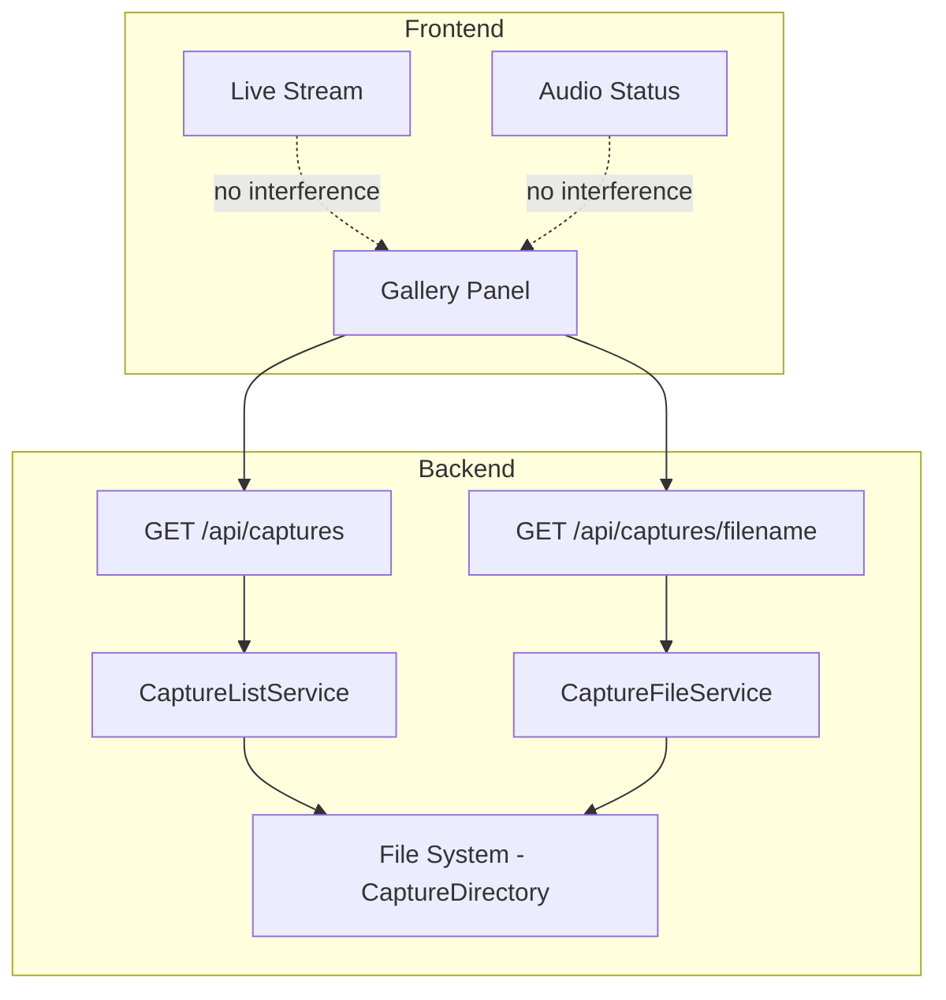

# Design Document: Capture Gallery

## Overview

The Capture Gallery feature extends the SwiftCam web page with a browsable gallery of motion-captured images. It adds two backend API endpoints (`/api/captures` and `/api/captures/{filename}`) and a frontend UI panel that displays thumbnails in a scrollable grid below the existing audio status panel.

The design follows the existing patterns established in the codebase:
- API endpoints defined as minimal API routes in `MapRoutes`
- Static utility classes for pure logic (no state, no DI needed)
- Configuration reused from existing `MotionSettings.CaptureDirectory`
- Inline HTML/CSS/JS served from `Program.cs` (same approach as the current page)

## Architecture

The feature introduces a thin read-only layer on top of the existing capture storage. No new background services or state machines are required.



### Key Design Decisions

**Static utility classes for capture serving logic**: Following the precedent set by `CaptureWriter`, `FrameDifferencer`, and `GreyscaleFilter`, the file listing and validation logic will be implemented as static methods. They are pure functions with no state.

**Reuse MotionSettings.CaptureDirectory**: The gallery reads from the same directory the motion detector writes to. No additional configuration is needed.

**No pagination for v1**: The filename-sorted list returns all captures. At 640×480 JPEG quality 80, captures average ~30KB each. A typical day with moderate motion produces tens of files, not thousands. Pagination adds complexity without immediate benefit for this use case.

**Filename-based sorting instead of file metadata**: Since `CaptureWriter.GenerateFilename` encodes the timestamp in the filename (`yyyy-MMM-dd_HH-mm-ss.jpg`), reverse alphabetical sort produces reverse chronological order. This avoids filesystem metadata queries.

**No server-side thumbnail generation**: Serving full JPEGs and using CSS to display them at thumbnail size. At 640×480 quality 80 (~30KB), the images are already small enough for quick loading over LAN. This avoids adding image processing complexity.

## Components and Interfaces

### CaptureListService (Static Class)

Responsible for listing capture filenames from disk.

```csharp
public static class CaptureListService
{
    /// <summary>
    /// Returns .jpg filenames from the capture directory, sorted most recent first.
    /// Returns empty array if directory doesn't exist or contains no .jpg files.
    /// </summary>
    public static string[] GetCaptureFilenames(string captureDirectory);
}
```

**Behaviour:**
- If directory doesn't exist → returns empty array
- If directory exists but has no `.jpg` files → returns empty array
- Filters to only `.jpg` extension (case-insensitive)
- Sorts filenames in descending order (reverse alphabetical = most recent first)

### CaptureFileService (Static Class)

Responsible for validating and resolving capture file requests.

```csharp
public static class CaptureFileService
{
    /// <summary>
    /// Validates the filename and returns the full path if valid and exists.
    /// Returns null if the file doesn't exist.
    /// Throws ArgumentException if the filename contains path traversal or has no .jpg extension.
    /// </summary>
    public static string? ResolveCaptureFile(string filename, string captureDirectory);

    /// <summary>
    /// Returns true if the filename is safe (no path traversal, has .jpg extension).
    /// </summary>
    public static bool IsValidFilename(string filename);
}
```

**Validation rules:**
- Must end with `.jpg` (case-insensitive)
- Must not contain `..` anywhere
- Must not contain `/` or `\` (path separators)
- Must not be empty or whitespace

### API Endpoints (in MapRoutes)

Two new routes added to `Program.MapRoutes`:

| Endpoint | Method | Success | Error Cases |
|----------|--------|---------|-------------|
| `/api/captures` | GET | 200 + JSON array of filenames | — |
| `/api/captures/{filename}` | GET | 200 + JPEG file | 400 (invalid filename), 404 (not found) |

### Frontend Gallery Panel

A new `<div id="capture-gallery">` section added to the HTML page, containing:
- Heading ("Captures")
- Refresh button
- Scrollable grid container for thumbnails
- JavaScript IIFE for fetch/render logic

## Data Models

### API Response: GET /api/captures

```json
["2025-Jan-15_14-30-22.jpg", "2025-Jan-15_14-25-10.jpg", "2025-Jan-14_09-12-03.jpg"]
```

Simple JSON string array. No wrapping object — keeps it lightweight and the frontend parsing trivial.

### API Response: GET /api/captures/{filename}

Raw JPEG binary with `Content-Type: image/jpeg`.

### Frontend State

The gallery JavaScript maintains minimal state:
- `isLoading: boolean` — controls refresh button disabled state
- `captures: string[]` — current list of filenames from API

### Filename Format

Reuses the existing format from `CaptureWriter.GenerateFilename`:
```
yyyy-MMM-dd_HH-mm-ss.jpg
```
Example: `2025-Jan-15_14-30-22.jpg`

The frontend parses this for display as a human-readable timestamp below each thumbnail.


## Correctness Properties

*A property is a characteristic or behavior that should hold true across all valid executions of a system — essentially, a formal statement about what the system should do. Properties serve as the bridge between human-readable specifications and machine-verifiable correctness guarantees.*

### Property 1: Capture listing is sorted most-recent-first

*For any* set of valid capture filenames (matching `yyyy-MMM-dd_HH-mm-ss.jpg` format) present in a directory, `GetCaptureFilenames` SHALL return them in descending alphabetical order (which corresponds to reverse chronological order given the filename format).

**Validates: Requirements 1.1**

### Property 2: Capture listing includes only .jpg files

*For any* directory containing a mix of files with various extensions, `GetCaptureFilenames` SHALL return only those filenames ending with `.jpg` (case-insensitive), and the returned count SHALL equal the number of `.jpg` files in the directory.

**Validates: Requirements 1.4**

### Property 3: Invalid filenames are always rejected

*For any* filename string that contains path traversal characters (`..`, `/`, `\`) OR does not end with `.jpg`, `IsValidFilename` SHALL return false. Conversely, *for any* filename string that has a `.jpg` extension AND contains no path traversal characters AND is not empty/whitespace, `IsValidFilename` SHALL return true.

**Validates: Requirements 2.3, 2.4**

### Property 4: Filename timestamp parsing round-trip

*For any* valid `DateTime` value, generating a capture filename via `CaptureWriter.GenerateFilename` and then parsing the timestamp back from that filename SHALL yield the same date and time components (year, month, day, hour, minute, second).

**Validates: Requirements 4.4**

## Error Handling

| Scenario | Response | Behaviour |
|----------|----------|-----------|
| Capture directory doesn't exist | 200 + `[]` | `GetCaptureFilenames` catches `DirectoryNotFoundException` and returns empty array |
| Capture directory is empty | 200 + `[]` | No `.jpg` files found, returns empty array |
| Requested file doesn't exist | 404 | `ResolveCaptureFile` returns null, endpoint returns 404 |
| Filename contains path traversal | 400 | `IsValidFilename` returns false, endpoint returns 400 before any file I/O |
| Filename has wrong extension | 400 | `IsValidFilename` returns false, endpoint returns 400 |
| File I/O error during listing | 200 + `[]` | Catch `IOException`, log warning, return empty array |
| File I/O error during file serve | 500 | Let ASP.NET Core default error handling respond |
| Frontend fetch fails | Error message in gallery | Gallery displays "Failed to load captures" without affecting stream or audio status |

### Security Considerations

- **Path traversal prevention**: Filename validation rejects `..`, `/`, and `\` characters before any filesystem access. This is a defence-in-depth measure — even if validation were bypassed, `Path.Combine` with a directory-confined path and `Path.GetFullPath` check would prevent escape.
- **Extension restriction**: Only `.jpg` files are served, preventing accidental exposure of other files that might end up in the capture directory.
- **No user-uploaded content**: The gallery is read-only over files produced by the motion detector. No upload endpoint exists.

## Testing Strategy

### Unit Tests (xUnit)

Example-based tests for specific scenarios:
- `GET /api/captures` with empty directory returns `[]`
- `GET /api/captures` with non-existent directory returns `[]`
- `GET /api/captures/{filename}` with existing file returns 200 + correct bytes
- `GET /api/captures/{filename}` with missing file returns 404
- `GET /api/captures/{filename}` with `../etc/passwd` returns 400
- `GET /api/captures/{filename}` with `test.png` returns 400
- Gallery HTML contains expected structure (heading, refresh button, container)

### Property-Based Tests (FsCheck, 100 iterations each)

Each property test maps to a correctness property from the design:

1. **Capture listing sort order** — Generate random sets of valid capture filenames, write them to a temp directory, call `GetCaptureFilenames`, verify result is sorted descending.
   - Tag: `Feature: capture-gallery, Property 1: Capture listing is sorted most-recent-first`

2. **Capture listing .jpg filter** — Generate directories with mixed file extensions (`.jpg`, `.png`, `.txt`, `.jpeg`, `.JPG`), call `GetCaptureFilenames`, verify only `.jpg` files are returned.
   - Tag: `Feature: capture-gallery, Property 2: Capture listing includes only .jpg files`

3. **Filename validation rejects invalid inputs** — Generate filenames with path traversal chars and/or non-.jpg extensions, verify `IsValidFilename` returns false for all. Also generate valid filenames and verify it returns true.
   - Tag: `Feature: capture-gallery, Property 3: Invalid filenames are always rejected`

4. **Filename timestamp parsing round-trip** — Generate random `DateTime` values, produce filename via `CaptureWriter.GenerateFilename`, parse the timestamp back, verify components match.
   - Tag: `Feature: capture-gallery, Property 4: Filename timestamp parsing round-trip`

### Integration Tests (WebApplicationFactory)

- `GET /api/captures` returns `Content-Type: application/json` and status 200
- `GET /api/captures/{filename}` returns `Content-Type: image/jpeg` for valid files
- Gallery endpoints don't interfere with `/stream` or `/api/audio-status`
- Application starts correctly with new routes registered

### Test Framework

- **xUnit** for test runner (existing)
- **FsCheck.Xunit** for property-based tests (existing, `[Property(MaxTest = 100)]`)
- **Microsoft.AspNetCore.Mvc.Testing** for integration tests (existing)
- Temp directories via `Path.GetTempPath()` for filesystem tests, cleaned up in `Dispose`
