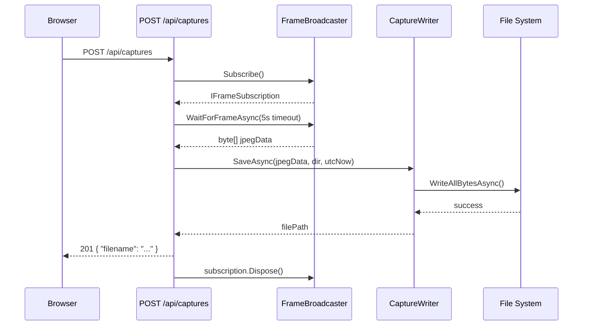
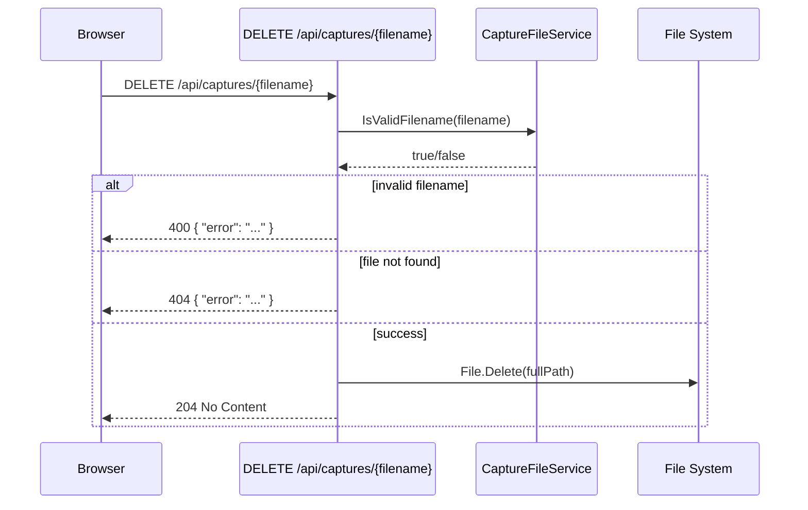

# Design Document: Capture Management

## Overview

This design extends the existing SwiftCam capture gallery with two new API endpoints (`POST /api/captures` and `DELETE /api/captures/{filename}`) and their corresponding UI controls in the gallery panel. The implementation follows the existing architectural patterns: static service classes for pure logic, thin route handlers in `Program.cs`, and inline JavaScript for the frontend.

The manual capture endpoint subscribes to the existing `FrameBroadcaster`, grabs the next frame, and writes it via the existing `CaptureWriter`. The delete endpoint validates the filename using the existing `CaptureFileService` and removes the file. Both endpoints reuse established patterns and require minimal new service code.

## Architecture

The feature fits into the existing system without introducing new background services or state. The new endpoints are synchronous request handlers that interact with existing singletons.





## Components and Interfaces

### New: CaptureService (static class)

A new static utility class encapsulating the manual capture logic: subscribe to broadcaster, wait for frame with timeout, handle filename deduplication, and save.

```csharp
namespace SwiftCam;

public static class CaptureService
{
    /// <summary>
    /// Captures a single frame from the broadcaster and saves it to disk.
    /// Returns the filename of the saved capture.
    /// Throws TimeoutException if no frame arrives within the timeout.
    /// Throws IOException if the file cannot be written.
    /// </summary>
    public static async Task<string> CaptureFrameAsync(
        IFrameBroadcaster broadcaster,
        string captureDirectory,
        TimeProvider timeProvider,
        TimeSpan timeout,
        CancellationToken ct = default);

    /// <summary>
    /// Generates a unique filename for the given timestamp by appending
    /// a numeric suffix (_1, _2, ...) if the base filename already exists.
    /// </summary>
    public static string GenerateUniqueFilename(
        DateTime timestamp,
        string captureDirectory);
}
```

### New: CaptureDeleteService (static class)

A static utility for performing the delete operation with proper error handling.

```csharp
namespace SwiftCam;

public static class CaptureDeleteService
{
    /// <summary>
    /// Deletes the specified capture file from the directory.
    /// Throws FileNotFoundException if the file doesn't exist.
    /// Throws IOException if the delete operation fails.
    /// Throws ArgumentException if the filename is invalid.
    /// </summary>
    public static void DeleteCapture(string filename, string captureDirectory);
}
```

### Modified: Program.cs (route registration)

Two new route handlers added to `MapRoutes`:
- `app.MapPost("/api/captures", ...)` — invokes `CaptureService.CaptureFrameAsync`
- `app.MapDelete("/api/captures/{filename}", ...)` — invokes `CaptureDeleteService.DeleteCapture`

### Modified: Program.cs (HTML/JavaScript)

The `HtmlPage` constant updated to include:
- A "Take Capture" button in the gallery header
- Delete controls on each thumbnail
- A confirmation dialog for deletions
- JavaScript functions for capture/delete with loading states and error handling

### Existing (reused, unchanged):
- `IFrameBroadcaster` / `FrameBroadcaster` — Subscribe to get frames
- `IFrameSubscription` — Wait for next frame with cancellation
- `CaptureWriter` — `GenerateFilename()` and `SaveAsync()` for disk writes
- `CaptureFileService` — `IsValidFilename()` and `ResolveCaptureFile()` for validation
- `CaptureListService` — `GetCaptureFilenames()` for gallery refresh
- `MotionSettings.CaptureDirectory` — Shared capture directory configuration
- `TimeProvider` — Testable timestamp generation

## Data Models

### POST /api/captures Response (201 Created)

```json
{
  "filename": "2025-Jun-15_14-30-22.jpg"
}
```

### Error Response Format (400, 404, 500, 503)

```json
{
  "error": "Human-readable error message describing what went wrong"
}
```

### Filename Generation

Filenames follow the existing pattern: `yyyy-MMM-dd_HH-mm-ss.jpg`

When a collision occurs (same-second duplicate), the suffix format is: `yyyy-MMM-dd_HH-mm-ss_1.jpg`, `yyyy-MMM-dd_HH-mm-ss_2.jpg`, etc.

### UI State Model (JavaScript)

The gallery panel JavaScript manages these states:
- `isCaptureLoading: boolean` — Tracks in-flight POST request
- `pendingDelete: string | null` — Filename awaiting confirmation
- `deletingFiles: Set<string>` — Filenames with in-flight DELETE requests

## Correctness Properties

*A property is a characteristic or behavior that should hold true across all valid executions of a system — essentially, a formal statement about what the system should do. Properties serve as the bridge between human-readable specifications and machine-verifiable correctness guarantees.*

### Property 1: Capture save round-trip

*For any* valid byte array representing JPEG frame data, if `CaptureService.CaptureFrameAsync` completes successfully, then reading the saved file from the capture directory should yield byte content identical to the original frame data.

**Validates: Requirements 1.1**

### Property 2: Filename deduplication uniqueness

*For any* timestamp and any number of pre-existing files with the same base filename, `CaptureService.GenerateUniqueFilename` should return a filename that does not match any existing file in the directory and follows the format `yyyy-MMM-dd_HH-mm-ss_N.jpg` where N is the lowest positive integer producing a unique name.

**Validates: Requirements 1.6**

### Property 3: Filename validation rejects all path traversal

*For any* string containing `..`, `/`, or `\`, `CaptureFileService.IsValidFilename` should return false.

**Validates: Requirements 2.3**

### Property 4: Filename validation rejects non-jpg extensions

*For any* string that does not end with `.jpg` (case-insensitive), `CaptureFileService.IsValidFilename` should return false.

**Validates: Requirements 2.4**

> Note: Properties 3 and 4 are already validated by the existing `CaptureFileValidationPropertyTests` in the test suite. They are listed here for traceability but do not require new test implementations.

## Error Handling

### POST /api/captures

| Condition | HTTP Status | Error Message |
|-----------|-------------|---------------|
| Frame received and saved | 201 | N/A (success response with filename) |
| No frame within 5 seconds | 503 | "No camera frame available — the camera may not be running" |
| File write fails (IOException) | 500 | "Capture could not be saved due to a file system error" |
| Max subscribers exceeded | 503 | "No camera frame available — maximum stream subscribers reached" |

The 5-second timeout is enforced via `CancellationTokenSource` linked to the request's `RequestAborted` token. The subscription is always disposed in a `finally` block to avoid leaking broadcaster slots.

### DELETE /api/captures/{filename}

| Condition | HTTP Status | Error Message |
|-----------|-------------|---------------|
| File deleted successfully | 204 | N/A (no body) |
| Filename contains path traversal | 400 | "Invalid filename: path traversal characters are not allowed" |
| Filename missing .jpg extension | 400 | "Invalid filename: only .jpg files are supported" |
| File does not exist | 404 | "Capture not found: the specified file does not exist" |
| File system error on delete | 500 | "Deletion could not be completed due to a file system error" |

### UI Error Handling

- Error messages displayed in a `<div>` within the gallery panel, auto-dismissed after 5 seconds via `setTimeout`
- Errors do not affect other page components (stream, audio status)
- Network errors (fetch rejection) treated the same as HTTP error responses

## Testing Strategy

### Unit Tests (Example-Based)

| Test | Validates |
|------|-----------|
| POST /api/captures returns 201 with filename on success | Req 1.2 |
| POST /api/captures returns 503 when no frame within timeout | Req 1.3 |
| POST /api/captures returns 500 when file write fails | Req 1.5 |
| DELETE returns 204 when file exists and is deleted | Req 2.1 |
| DELETE returns 404 when file does not exist | Req 2.2 |
| DELETE returns 400 for path traversal filenames | Req 2.3 |
| DELETE returns 400 for non-.jpg filenames | Req 2.4 |
| DELETE returns 500 when file system error occurs | Req 2.5 |
| HTML contains "Take Capture" button in gallery-header | Req 3.1 |

### Property-Based Tests (FsCheck, 100+ iterations)

| Property | Test Description |
|----------|-----------------|
| Property 1 | Generate random byte arrays, capture via mocked broadcaster, verify file contents match |
| Property 2 | Generate random timestamps + random sets of existing filenames, verify uniqueness and suffix format |

Properties 3 and 4 are already covered by existing `CaptureFileValidationPropertyTests`.

### Integration Tests

| Test | Validates |
|------|-----------|
| POST /api/captures with live broadcaster returns 201 and creates file | Req 1.1, 1.2 |
| DELETE /api/captures/{filename} removes file from disk | Req 2.1 |
| Capture/delete operations don't interrupt active MJPEG streams | Req 5.1, 5.3 |
| Capture/delete operations complete within 5 seconds under load | Req 5.5 |
| Gallery refresh after capture includes new file | Req 3.3 |

### Test Configuration

- Property-based testing library: **FsCheck** (already used in the project)
- Minimum iterations: 100 per property test
- Tag format: `Feature: capture-management, Property {N}: {description}`
- Mocked dependencies: `IFrameBroadcaster` (for unit/property tests), file system (via temp directories)
