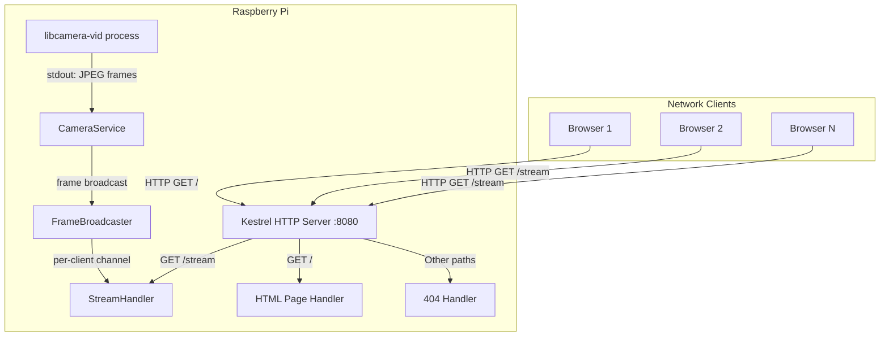

# Design Document: Pi Camera Webserver

## Overview

This application is a .NET 8 console application that runs on a Raspberry Pi and serves a live MJPEG video stream from the camera module over HTTP. It uses ASP.NET Core's minimal API with Kestrel as the HTTP server, spawns `libcamera-vid` (aliased as `rpicam-vid` on newer Raspberry Pi OS) as a child process to capture JPEG frames, and broadcasts those frames to multiple connected browser clients via multipart HTTP responses.

The design prioritizes simplicity (single-project, minimal dependencies), reliability under multiple concurrent viewers, and graceful handling of camera and network failures.

## Architecture



**Key architectural decisions:**

1. **Process-based camera capture**: Rather than binding to libcamera's C API (which has no stable .NET binding), we spawn `libcamera-vid --codec mjpeg -o -` and read JPEG frames from its stdout. This is the standard approach on Raspberry Pi and avoids native interop complexity.

2. **Single capture, multiple consumers**: One `libcamera-vid` process captures frames. A `FrameBroadcaster` distributes each frame to all connected clients via bounded channels, decoupling capture speed from client consumption speed.

3. **Bounded channels with drop policy**: Each client gets a bounded channel. If a slow client can't keep up, frames are dropped for that client only — other clients are unaffected.

4. **ASP.NET Core Minimal API**: Lightweight, minimal ceremony. Two endpoints (GET `/` and GET `/stream`) plus a catch-all 404.

## Components and Interfaces

### 1. Program / Application Entry Point

**Responsibility**: Configure and start the ASP.NET Core host, register services, map routes, handle shutdown signals.

```csharp
public class Program
{
    static async Task<int> Main(string[] args);
}
```

- Configures Kestrel to listen on `0.0.0.0:8080` (HTTP only)
- Registers `ICameraService` and `IFrameBroadcaster` as singletons
- Maps GET `/` → HTML page, GET `/stream` → MJPEG stream
- Maps fallback → 404
- Handles SIGTERM/SIGINT for graceful shutdown

### 2. ICameraService / CameraService

**Responsibility**: Manage the `libcamera-vid` child process, read JPEG frames from stdout, and push them to the broadcaster.

```csharp
public interface ICameraService : IHostedService, IDisposable
{
    bool IsRunning { get; }
}

public class CameraService : BackgroundService, ICameraService
{
    // Spawns libcamera-vid, reads stdout in a loop
    // Parses JPEG frame boundaries (SOI/EOI markers: 0xFFD8 / 0xFFD9)
    // Pushes complete frames to IFrameBroadcaster
}
```

**libcamera-vid invocation**:
```
libcamera-vid -t 0 --codec mjpeg --width 640 --height 480 --framerate 15 -q 80 -n -o -
```
- `-t 0`: Run indefinitely
- `--codec mjpeg`: Output MJPEG (individual JPEG frames)
- `--width 640 --height 480`: Resolution per requirement
- `--framerate 15`: Minimum 15 fps
- `-q 80`: JPEG quality (within 70-85 range)
- `-n`: No preview window
- `-o -`: Output to stdout

### 3. IFrameBroadcaster / FrameBroadcaster

**Responsibility**: Accept frames from the camera service and distribute them to all registered client subscriptions.

```csharp
public interface IFrameBroadcaster
{
    void PublishFrame(byte[] jpegData);
    IFrameSubscription Subscribe();
    int ClientCount { get; }
}

public interface IFrameSubscription : IDisposable
{
    ValueTask<byte[]> WaitForFrameAsync(CancellationToken ct);
}

public class FrameBroadcaster : IFrameBroadcaster
{
    private readonly ConcurrentDictionary<Guid, Channel<byte[]>> _subscribers;
    private const int MaxSubscribers = 10;
    private const int ChannelCapacity = 3; // bounded, drop oldest on full
}
```

**Design rationale**:
- `Channel<byte[]>` with `BoundedChannelFullMode.DropOldest` ensures slow clients don't block the broadcaster or other clients
- Channel capacity of 3 provides a small buffer while keeping memory pressure low
- `ConcurrentDictionary` for thread-safe subscriber management

### 4. MjpegStreamResult

**Responsibility**: Write the multipart MJPEG response to the HTTP response stream for a single client.

```csharp
public class MjpegStreamWriter
{
    public static async Task WriteStreamAsync(
        HttpContext context,
        IFrameBroadcaster broadcaster,
        ILogger logger,
        CancellationToken ct);
}
```

- Sets `Content-Type: multipart/x-mixed-replace; boundary=frame`
- Loops: waits for frame from subscription, writes boundary + headers + JPEG data
- On client disconnect (CancellationToken), disposes subscription and exits

### 5. Route Handlers

**GET `/`** — Returns the Video Page HTML:
```html
<!DOCTYPE html>
<html>
<head><title>Raspberry Pi Camera</title></head>
<body>
    
</body>
</html>
```

**GET `/stream`** — Initiates MJPEG streaming via `MjpegStreamWriter`.

**Fallback (all other paths)** — Returns 404 with plain-text body.

### 6. Logging

Uses the built-in `Microsoft.Extensions.Logging` with console provider. Log entries include timestamps by default via the console logger's `TimestampFormat` configuration.

## Data Models

### JpegFrame (internal value)

Not a formal class — frames are passed as `byte[]` (raw JPEG data). The frame boundaries are detected by scanning for JPEG SOI (`0xFF 0xD8`) and EOI (`0xFF 0xD9`) markers in the stdout stream.

### MJPEG Multipart Frame Format

Each frame sent to the client follows this wire format:
```
--frame\r\n
Content-Type: image/jpeg\r\n
Content-Length: {byteCount}\r\n
\r\n
{JPEG binary data}
\r\n
```

### Application Configuration

| Setting | Default | Source |
|---------|---------|--------|
| HTTP Port | 8080 | Hardcoded (per requirement) |
| Resolution | 640×480 | Hardcoded |
| Framerate | 15 fps | Hardcoded |
| JPEG Quality | 80 | Hardcoded |
| Max Clients | 10 | Constant |
| Channel Capacity | 3 | Constant |
| Shutdown Timeout | 5 seconds | Constant |

## Correctness Properties

*A property is a characteristic or behavior that should hold true across all valid executions of a system — essentially, a formal statement about what the system should do. Properties serve as the bridge between human-readable specifications and machine-verifiable correctness guarantees.*

### Property 1: Unknown paths return 404

*For any* HTTP GET request path that is not "/" and not "/stream", the Web Server shall respond with HTTP status 404 and a plain-text body.

**Validates: Requirements 2.5**

### Property 2: MJPEG frame format integrity

*For any* byte array representing JPEG image data, formatting it as an MJPEG multipart part shall produce output containing the boundary marker "--frame", a Content-Type header of "image/jpeg", a Content-Length header whose numeric value equals the byte array length, and the original byte data unchanged.

**Validates: Requirements 4.3**

### Property 3: Non-GET methods on /stream return 405

*For any* HTTP method other than GET (e.g., POST, PUT, DELETE, PATCH, OPTIONS), sending a request to the "/stream" path shall return HTTP status 405 without initiating a stream.

**Validates: Requirements 4.6**

### Property 4: Frame broadcast delivers to all subscribers

*For any* set of active subscribers (1 to 10), when a frame is published to the broadcaster, every subscriber shall receive that frame. Adding a new subscriber shall not prevent existing subscribers from receiving subsequent frames.

**Validates: Requirements 5.1, 5.2**

### Property 5: Slow subscriber isolation

*For any* set of subscribers where one subscriber is not consuming frames, publishing frames beyond the channel capacity shall still deliver the latest frames to all other (fast) subscribers without blocking or dropping their frames.

**Validates: Requirements 5.4**

## Error Handling

### Camera Process Failures

| Failure | Detection | Response |
|---------|-----------|----------|
| Camera not detected | `libcamera-vid` exits immediately with non-zero code | Log error with stderr content, terminate app with exit code 1 within 5 seconds |
| Process crashes mid-stream | Process `Exited` event fires | Log error, attempt restart once; if restart fails, terminate app |
| Stdout stream closed unexpectedly | `ReadAsync` returns 0 bytes | Treat as process crash (above) |

### Network / Client Failures

| Failure | Detection | Response |
|---------|-----------|----------|
| Client disconnects mid-stream | `CancellationToken` triggered by Kestrel | Dispose subscription, log disconnection with client IP |
| Client too slow | Bounded channel full | Drop oldest frame for that client (automatic via `BoundedChannelFullMode.DropOldest`) |
| Max clients exceeded | `ClientCount >= 10` check before subscribing | Return HTTP 503 (Service Unavailable) with plain-text body |

### Server Startup Failures

| Failure | Detection | Response |
|---------|-----------|----------|
| Port 8080 in use | `SocketException` during Kestrel bind | Log error indicating port conflict, exit with non-zero code |
| libcamera-vid not found | `Process.Start` throws or exits immediately with "not found" | Log error, exit with non-zero code |

### Graceful Shutdown

On SIGTERM/SIGINT:
1. `IHostApplicationLifetime.StopApplication()` is triggered
2. Kestrel stops accepting new connections
3. `CameraService.StopAsync()` sends SIGTERM to `libcamera-vid` child process
4. All client subscriptions are cancelled via `CancellationToken`
5. Application exits within 5-second shutdown timeout (configured via `HostOptions.ShutdownTimeout`)

## Testing Strategy

### Unit Tests (Example-Based)

Unit tests cover specific scenarios, configuration verification, and edge cases:

- **HTML page content**: Verify GET `/` returns 200, correct Content-Type, DOCTYPE, title, and img element
- **Stream response headers**: Verify GET `/stream` returns correct Content-Type header
- **Command-line arguments**: Verify `CameraService` constructs the correct `libcamera-vid` arguments (resolution, framerate, quality)
- **Client limit enforcement**: Verify 11th client is rejected with appropriate HTTP error
- **Graceful shutdown**: Verify shutdown completes within timeout
- **Port conflict handling**: Verify error logging and non-zero exit on port conflict
- **Camera failure handling**: Verify error logging and exit when process fails to start

### Property-Based Tests

Property-based tests validate universal correctness across randomized inputs. The project will use **FsCheck** (via the `FsCheck.Xunit` NuGet package) as the property-based testing library, integrated with xUnit.

**Configuration:**
- Minimum 100 iterations per property test
- Each test tagged with a comment referencing its design property

**Properties to implement:**

1. **Feature: pi-camera-webserver, Property 1: Unknown paths return 404**
   - Generator: Random valid URL path strings (excluding "/" and "/stream")
   - Assertion: Response status is 404, body is plain text

2. **Feature: pi-camera-webserver, Property 2: MJPEG frame format integrity**
   - Generator: Random byte arrays (1 byte to 500KB)
   - Assertion: Formatted output contains correct boundary, Content-Type, Content-Length matching input length, and original bytes

3. **Feature: pi-camera-webserver, Property 3: Non-GET methods on /stream return 405**
   - Generator: Random HTTP method strings from {POST, PUT, DELETE, PATCH, HEAD, OPTIONS, TRACE}
   - Assertion: Response status is 405

4. **Feature: pi-camera-webserver, Property 4: Frame broadcast delivers to all subscribers**
   - Generator: Random subscriber count (1-10), random frame data
   - Assertion: All subscribers receive the published frame

5. **Feature: pi-camera-webserver, Property 5: Slow subscriber isolation**
   - Generator: Random number of fast subscribers (1-9), random frames (count > channel capacity)
   - Assertion: Fast subscribers receive all frames; slow subscriber's channel doesn't block others

### Integration Tests

Integration tests verify end-to-end behavior on real hardware:

- Camera capture produces valid JPEG frames (SOI/EOI markers present)
- Multiple browsers can connect and receive frames simultaneously
- Frame rate meets minimum 15 fps requirement
- Application starts and stops cleanly on Raspberry Pi

### Test Project Structure

```
tests/
  SwiftCam.Tests/
    SwiftCam.Tests.csproj          (xUnit + FsCheck.Xunit)
    Unit/
      HtmlPageTests.cs
      RoutingTests.cs
      CameraServiceConfigTests.cs
      ClientLimitTests.cs
    Properties/
      RoutingPropertyTests.cs      (Properties 1, 3)
      MjpegFormatPropertyTests.cs  (Property 2)
      BroadcasterPropertyTests.cs  (Properties 4, 5)
    Integration/
      CameraIntegrationTests.cs
      StreamingIntegrationTests.cs
```

