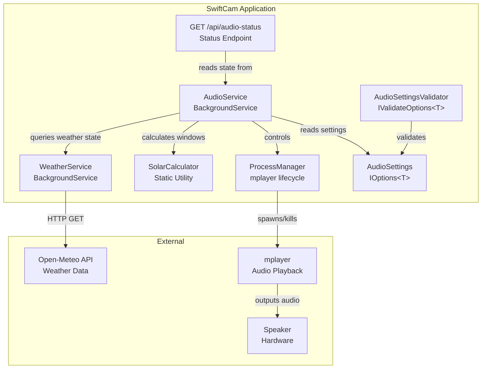
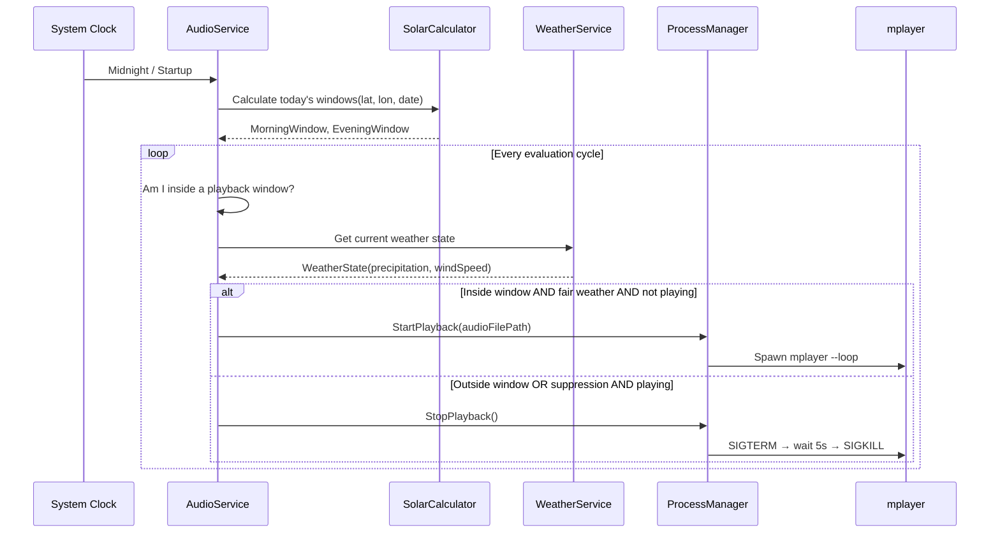
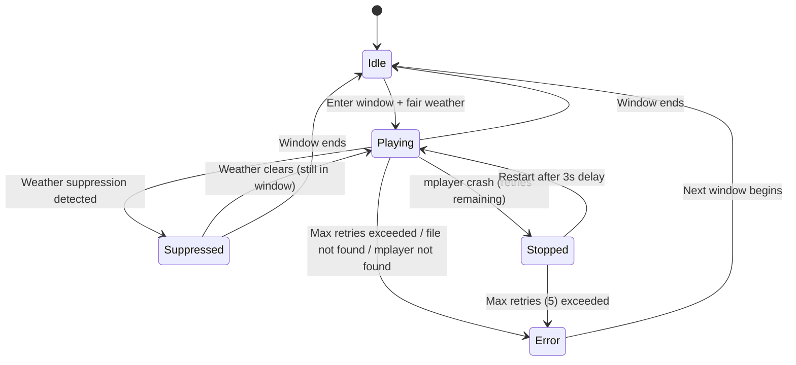

# Design Document: Swift Audio Attraction

## Overview

The Swift Audio Attraction feature extends SwiftCam with a scheduled audio playback system that attracts swifts to the birdbox. The system orchestrates an `mplayer` child process to play looped audio during two daily time windows (morning and evening), calculated from solar events (civil twilight and sunset) for a configured geographic location. Playback is suppressed when weather conditions (rain or high wind) make swift flight unlikely.

The feature integrates into the existing architecture by following the same patterns: a `BackgroundService` for the audio lifecycle, strongly-typed `IOptions<T>` settings with `IValidateOptions<T>` validation, `TimeProvider` for testability, and a new HTTP endpoint for status reporting. A lightweight weather polling component fetches conditions from the Open-Meteo API.

### Key Design Decisions

1. **Solar calculations performed in-process** — Using a NuGet library (SolarCalculator) rather than an external API eliminates network dependency for schedule computation. Civil twilight and sunset times are recalculated daily at midnight and on startup.

2. **State machine approach for audio lifecycle** — The audio service models its state as a finite state machine (Idle → Playing → Suppressed → Error), making transitions explicit and testable without running mplayer.

3. **Weather as a separate service** — Decoupling weather polling from the audio service allows independent testing and clear responsibility boundaries. The weather service publishes state that the audio service observes.

4. **Process management mirrors CameraService** — The mplayer process lifecycle (start, graceful termination with timeout, force-kill) follows the same proven pattern as `CameraService` for rpicam-vid.

## Architecture



### Data Flow



## Components and Interfaces

### AudioSettings (POCO)

Strongly-typed configuration class bound from the `"Audio"` section of `appsettings.json`. Follows the same pattern as `CameraSettings` and `MotionSettings`.

### AudioSettingsValidator

Implements `IValidateOptions<AudioSettings>` following the same pattern as `CameraSettingsValidator` and `MotionSettingsValidator`. Validates all numeric ranges and non-empty strings at startup.

### ISolarCalculator (Interface)

```csharp
public interface ISolarCalculator
{
    SolarTimes Calculate(double latitude, double longitude, DateTime date);
}
```

Abstracts solar time computation for testability. The implementation wraps the SolarCalculator NuGet package.

### SolarTimes (Record)

```csharp
public record SolarTimes(
    TimeOnly? CivilTwilight,
    TimeOnly? Sunrise,
    TimeOnly? Sunset);
```

Nullable times handle polar edge cases where no event occurs.

### PlaybackWindow (Record)

```csharp
public record PlaybackWindow(DateTime Start, DateTime End);
```

Represents a calculated playback time range for a specific day.

### IWeatherService (Interface)

```csharp
public interface IWeatherService
{
    WeatherState CurrentWeather { get; }
}
```

Exposes the latest weather state for consumption by the audio service.

### WeatherState (Record)

```csharp
public record WeatherState(
    double PrecipitationMm,
    double WindSpeedKph,
    DateTime? LastUpdated);
```

### WeatherService (BackgroundService)

Polls Open-Meteo API at the configured interval. Stores the latest `WeatherState`. On fetch failure, retains the previous state and increments a consecutive failure counter. After 3+ consecutive failures, assumes fair weather. On first start with no data, assumes fair weather.

**Open-Meteo API call:**
```
GET https://api.open-meteo.com/v1/forecast?latitude={lat}&longitude={lon}&current=precipitation,wind_speed_10m
```

Response fields used:
- `current.precipitation` — mm of rainfall
- `current.wind_speed_10m` — km/h at 10m height

### AudioState (Enum)

```csharp
public enum AudioState
{
    Idle,       // Outside any playback window
    Playing,    // mplayer is actively playing
    Suppressed, // Inside window but weather prevents playback
    Stopped,    // Inside window, fair weather, but stopped (e.g., between restart attempts)
    Error       // Unrecoverable error (file not found, mplayer not installed, max retries)
}
```

### AudioService (BackgroundService)

The core orchestrator. Implements the main scheduling loop:

1. On startup and at midnight: calculate today's playback windows via `ISolarCalculator`
2. Every second: evaluate current state based on time and weather
3. Manage transitions between states, delegating process control to the process manager

**State Machine:**



**Key responsibilities:**
- Calculate and cache daily playback windows
- Evaluate whether the current time falls within a window
- Check weather state for suppression conditions
- Start/stop mplayer via the process manager
- Track consecutive restart failures (reset at window boundary)
- Expose current state and reason for the status endpoint

### IAudioProcessManager (Interface)

```csharp
public interface IAudioProcessManager
{
    bool IsPlaying { get; }
    void Start(string audioFilePath);
    Task StopAsync(CancellationToken cancellationToken = default);
}
```

### AudioProcessManager (Implementation)

Manages the mplayer child process lifecycle:
- `Start()` — spawns `mplayer -loop 0 <file>` with stdout/stderr redirected
- `StopAsync()` — sends SIGTERM (Process.Kill on Windows), waits up to 5 seconds, then force-kills if still running
- `IsPlaying` — returns whether the process is alive

Follows the same pattern as `CameraService`'s process management but extracted into a dedicated class for single-responsibility and testability.

### AudioStatusResponse (DTO)

```csharp
public record AudioStatusResponse(
    string State,
    string Reason,
    string? CurrentWindowStart,
    string? CurrentWindowEnd,
    string? NextWindowStart);
```

Returned as JSON from the `/api/audio-status` endpoint.

### Status Endpoint

A minimal API `MapGet("/api/audio-status", ...)` that reads the current state from `AudioService` and returns an `AudioStatusResponse`. Follows the same routing pattern as the existing `/stream` endpoint.

### Web Page Update

The existing HTML page (`Program.HtmlPage`) is extended with a status panel `<div>` that:
- Polls `/api/audio-status` every 5 seconds via `fetch()`
- Displays state and reason text
- Shows "Status unavailable" on fetch failure
- Resumes normal display when connectivity returns

## Data Models

### Configuration Schema (appsettings.json)

```json
{
  "Audio": {
    "AudioFilePath": "audio/swift-call.mp3",
    "Latitude": 51.9,
    "Longitude": -2.07,
    "MorningOffsetMinutes": 0,
    "MorningDurationMinutes": 210,
    "EveningPreSunsetMinutes": 150,
    "WeatherPollIntervalMinutes": 15,
    "WindSpeedThresholdKph": 40
  }
}
```

### AudioSettings Class

| Property | Type | Default | Valid Range |
|----------|------|---------|-------------|
| AudioFilePath | string | "audio/swift-call.mp3" | Non-empty |
| Latitude | double | 51.9 | -90 to 90 |
| Longitude | double | -2.07 | -180 to 180 |
| MorningOffsetMinutes | int | 0 | -60 to 240 |
| MorningDurationMinutes | int | 210 | 1 to 720 |
| EveningPreSunsetMinutes | int | 150 | 1 to 480 |
| WeatherPollIntervalMinutes | int | 15 | 1 to 60 |
| WindSpeedThresholdKph | int | 40 | 1 to 120 |

### Validation Rules

| Property | Rule | Error Message Format |
|----------|------|---------------------|
| AudioFilePath | Not empty/whitespace | "AudioFilePath must not be empty." |
| Latitude | -90 ≤ x ≤ 90 | "Latitude must be between -90 and 90, got {value}." |
| Longitude | -180 ≤ x ≤ 180 | "Longitude must be between -180 and 180, got {value}." |
| MorningOffsetMinutes | -60 ≤ x ≤ 240 | "MorningOffsetMinutes must be between -60 and 240, got {value}." |
| MorningDurationMinutes | 1 ≤ x ≤ 720 | "MorningDurationMinutes must be between 1 and 720, got {value}." |
| EveningPreSunsetMinutes | 1 ≤ x ≤ 480 | "EveningPreSunsetMinutes must be between 1 and 480, got {value}." |
| WeatherPollIntervalMinutes | 1 ≤ x ≤ 60 | "WeatherPollIntervalMinutes must be between 1 and 60, got {value}." |
| WindSpeedThresholdKph | 1 ≤ x ≤ 120 | "WindSpeedThresholdKph must be between 1 and 120, got {value}." |

### DI Registration

```csharp
// Audio settings
builder.Services.Configure<AudioSettings>(builder.Configuration.GetSection("Audio"));
builder.Services.AddSingleton<IValidateOptions<AudioSettings>, AudioSettingsValidator>();
builder.Services.AddOptionsWithValidateOnStart<AudioSettings>();

// Services
builder.Services.AddSingleton<ISolarCalculator, SolarCalculatorWrapper>();
builder.Services.AddSingleton<IAudioProcessManager, AudioProcessManager>();
builder.Services.AddSingleton<IWeatherService, WeatherService>();
builder.Services.AddHostedService(sp => (WeatherService)sp.GetRequiredService<IWeatherService>());
builder.Services.AddHostedService<AudioService>();
builder.Services.AddHttpClient<WeatherService>();
```


## Correctness Properties

*A property is a characteristic or behavior that should hold true across all valid executions of a system — essentially, a formal statement about what the system should do. Properties serve as the bridge between human-readable specifications and machine-verifiable correctness guarantees.*

### Property 1: Playback decision correctness

*For any* combination of (current time, playback windows, weather state, audio state), the scheduling decision to play audio SHALL be true if and only if: the current time falls within an active playback window AND precipitation is 0 AND wind speed is at or below the configured threshold AND the retry limit has not been exceeded.

**Validates: Requirements 1.1, 1.2, 1.3, 1.4, 6.3, 6.4, 6.7**

### Property 2: Morning window calculation

*For any* valid latitude, longitude, date (where civil twilight is determinable), morning offset, and morning duration, the calculated morning playback window SHALL have start = civil_twilight + MorningOffsetMinutes and end = start + MorningDurationMinutes.

**Validates: Requirements 3.1, 3.2**

### Property 3: Evening window calculation

*For any* valid latitude, longitude, and date (where sunset is determinable), and EveningPreSunsetMinutes value, the calculated evening playback window SHALL have start = sunset - EveningPreSunsetMinutes and end = sunset.

**Validates: Requirements 4.1, 4.2**

### Property 4: Window overlap prevention

*For any* pair of morning and evening playback windows where the calculated evening start time is earlier than the morning end time, the adjusted evening start SHALL equal the morning end time, and the evening end SHALL remain unchanged.

**Validates: Requirements 4.4**

### Property 5: Retry state machine

*For any* sequence of mplayer crash events within a single playback window, the audio service SHALL attempt restart for crash counts 1 through 5, and SHALL transition to Error state and cease retries after the 5th consecutive failure.

**Validates: Requirements 1.5, 1.6**

### Property 6: Weather suppression classification

*For any* weather state and configured wind speed threshold, the weather IS a suppression condition if and only if precipitation > 0 OR wind speed > WindSpeedThresholdKph. Conversely, precipitation == 0 AND wind speed ≤ WindSpeedThresholdKph SHALL never be classified as a suppression condition.

**Validates: Requirements 6.3, 6.4, 6.7**

### Property 7: Settings validation rejects invalid values

*For any* `AudioSettings` instance where at least one field is outside its valid range (Latitude ∉ [-90,90], Longitude ∉ [-180,180], MorningDurationMinutes ∉ [1,1440], EveningPreSunsetMinutes ∉ [1,1440], WeatherPollIntervalMinutes ∉ [1,60], WindSpeedThresholdKph ∉ [1,120], or AudioFilePath is empty/whitespace), the validator SHALL return a failure result.

**Validates: Requirements 5.4, 5.5, 9.1, 9.2, 9.3, 9.4, 9.5, 9.6**

### Property 8: Status response well-formedness

*For any* audio state and playback window schedule, the status response SHALL have: state ∈ {"Playing", "Stopped", "Suppressed", "Idle", "Error"}, reason length ≤ 200 characters, and any included window times in valid ISO 8601 format (yyyy-MM-ddTHH:mm:ssZ).

**Validates: Requirements 7.2, 7.3, 7.4, 7.5**

## Error Handling

### Process Errors

| Scenario | Behaviour | Recovery |
|----------|-----------|----------|
| mplayer binary not found | Log error, enter Error state | Remain idle; operator installs mplayer |
| mplayer crashes mid-playback | Wait 3s, restart (up to 5 attempts) | Reset retry counter at next window |
| mplayer won't terminate gracefully | Force-kill after 5s timeout | Process cleaned up regardless |
| Audio file not found on disk | Log error, enter Error state | Check file on each window start |

### Weather Service Errors

| Scenario | Behaviour | Recovery |
|----------|-----------|----------|
| HTTP request fails (timeout, DNS, 5xx) | Log warning, retain last known state | Next poll attempt at configured interval |
| 3+ consecutive fetch failures | Assume fair weather, log warning | Resume normal tracking on next success |
| Invalid JSON response | Treat as fetch failure | Same as above |
| No successful fetch since startup | Assume fair weather | Normal tracking begins on first success |

### Configuration Errors

| Scenario | Behaviour | Recovery |
|----------|-----------|----------|
| Any validation failure | Application fails to start with error log | Operator fixes configuration and restarts |
| Audio file path invalid at runtime | Audio service enters Error state | Service checks file existence at each window start |

### Startup Order

The audio service depends on `IWeatherService` being registered. Both are `BackgroundService` instances started by the host. The weather service begins polling immediately; the audio service tolerates no weather data (assumes fair weather) so startup order between the two services doesn't matter.

## Testing Strategy

### Property-Based Tests (FsCheck.Xunit, 100+ iterations each)

The project already uses **FsCheck.Xunit** for property-based testing. Each property test below maps to a correctness property defined above.

| Property | Test Class | What It Generates |
|----------|-----------|-------------------|
| 1: Playback decision | `PlaybackDecisionPropertyTests` | Random (time, windows, weather, retryCount) tuples |
| 2: Morning window calc | `MorningWindowPropertyTests` | Random (lat, lon, date, offset, duration) |
| 3: Evening window calc | `EveningWindowPropertyTests` | Random (sunset time, preSunsetMinutes) |
| 4: Window overlap | `WindowOverlapPropertyTests` | Random overlapping window pairs |
| 5: Retry state machine | `RetryStateMachinePropertyTests` | Random crash event sequences (length 1-10) |
| 6: Weather suppression | `WeatherSuppressionPropertyTests` | Random (precipitation, windSpeed, threshold) |
| 7: Settings validation | `AudioSettingsValidatorPropertyTests` | Random AudioSettings with invalid fields |
| 8: Status response | `StatusResponsePropertyTests` | Random AudioState + PlaybackWindow combinations |

**Configuration:** Each property test uses `[Property(MaxTest = 100)]` and includes a tag comment:
```csharp
// Feature: swift-audio-attraction, Property N: <property text>
```

### Unit Tests (xUnit)

| Area | Test Class | Coverage |
|------|-----------|----------|
| AudioSettings defaults | `AudioSettingsDefaultsTests` | Default values for all properties |
| Validator boundary values | `AudioSettingsValidatorTests` | Exact boundary values (min-1, min, max, max+1) |
| Weather state initial | `WeatherServiceTests` | Fair weather assumed when no data |
| Weather consecutive failures | `WeatherServiceTests` | Fair weather after 3 failures |
| mplayer not found | `AudioServiceTests` | Error state on Win32Exception |
| Audio file not found | `AudioServiceTests` | Error state when file missing |
| Polar latitude edge cases | `SolarCalculatorTests` | Null windows for extreme latitudes |
| Status endpoint format | `StatusEndpointTests` | Correct JSON structure and content-type |

### Integration Tests

| Area | Test Class | Coverage |
|------|-----------|----------|
| DI wiring | `AudioServiceIntegrationTests` | Settings bind from config, services resolve |
| HTTP endpoint | `StatusEndpointIntegrationTests` | GET /api/audio-status returns 200 + JSON |
| Weather polling | `WeatherServiceIntegrationTests` | Mock HTTP handler, verify poll interval |
| Graceful shutdown | `AudioServiceLifecycleTests` | CancellationToken stops process |

### Test Dependencies

The test project already includes:
- `xunit` 2.7.x
- `FsCheck.Xunit` 2.16.x
- `Microsoft.AspNetCore.Mvc.Testing` 10.0.x

No additional test dependencies are needed. Weather service tests will use a custom `DelegatingHandler` to mock HTTP responses (standard .NET pattern with `IHttpClientFactory`).
