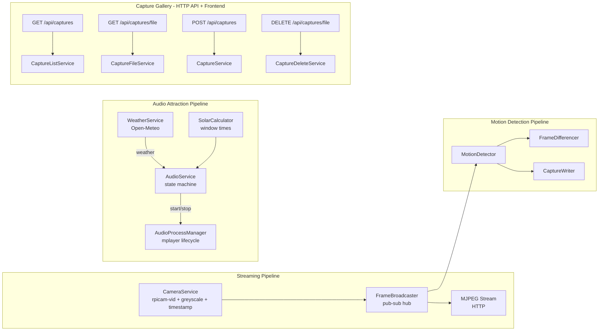
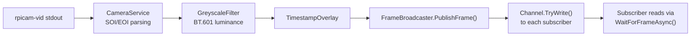
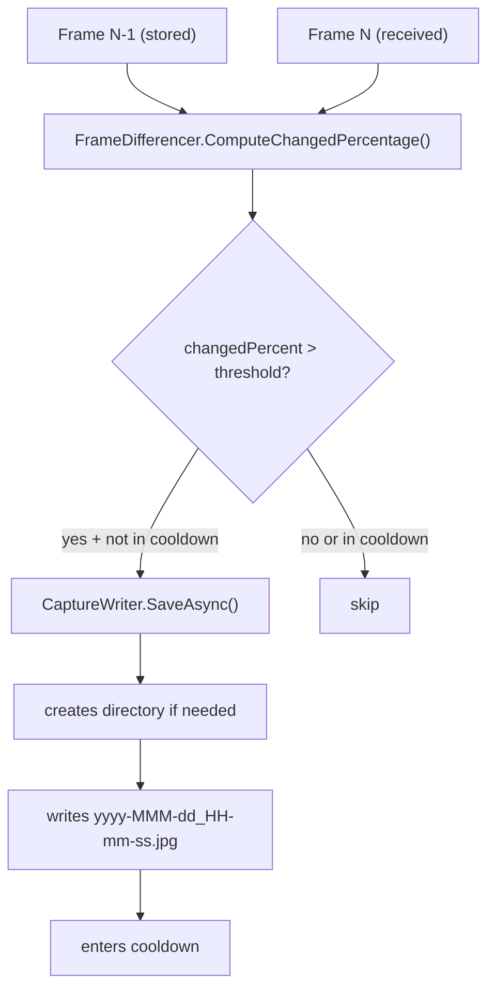
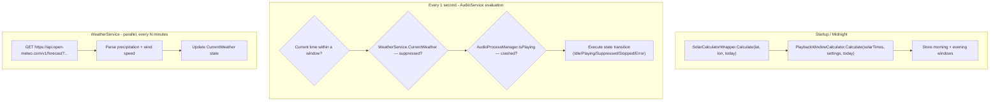

# Architecture

This document describes the internal design of SwiftCam — how the components fit together, how data flows through the system, and the rationale behind key decisions.

## System overview

SwiftCam is a single-process ASP.NET Core application that runs three concurrent pipelines:

1. **Streaming pipeline** — Captures frames from the camera hardware, broadcasts them to connected HTTP clients as an MJPEG stream.
2. **Motion detection pipeline** — Subscribes to the same frame broadcast, compares consecutive frames, and saves a JPEG to disk when motion is detected.
3. **Audio attraction pipeline** — Schedules looped audio playback during solar-event-based time windows, suppressing playback during adverse weather.
4. **Capture gallery** — Serves captured images via HTTP API, provides manual capture and deletion endpoints, and renders a browsable thumbnail gallery with interactive controls on the web page.

Both visual pipelines share the same frame source via a publish-subscribe broadcaster, so motion detection runs independently without affecting stream latency. The audio pipeline operates independently, managing an mplayer child process based on time, weather, and process state.



## Component details

### CameraService

A `BackgroundService` that spawns `rpicam-vid` (or `libcamera-vid` as fallback) as a child process. It reads raw JPEG frames from the process's stdout by scanning for SOI (`FF D8`) and EOI (`FF D9`) markers, converts to greyscale via `GreyscaleFilter`, applies a timestamp overlay, and publishes each complete frame to the broadcaster.

If the camera process exits within 5 seconds of starting, the application terminates (camera not detected). If it crashes mid-stream, one restart is attempted before terminating.

### GreyscaleFilter

A static utility that converts a JPEG frame to greyscale using SkiaSharp's colour matrix. It applies BT.601 luminance coefficients (`0.299R + 0.587G + 0.114B`) to all three output channels in a single draw operation, then re-encodes as JPEG.

This runs before the timestamp overlay so the overlay text is drawn on the greyscale image and remains crisp. The primary purpose is eliminating the purple/magenta cast that NoIR (no infrared filter) camera modules produce in daylight — since colour information from a NoIR sensor is unreliable anyway, greyscale gives a cleaner result.

### FrameBroadcaster

A thread-safe pub-sub hub. Each subscriber gets an independent bounded channel (capacity 3, drop-oldest policy) so a slow consumer never blocks other subscribers or the camera service. Supports up to 10 concurrent subscriptions.

Key interface:
- `PublishFrame(byte[] jpegData)` — Non-blocking fan-out to all subscribers
- `Subscribe()` — Returns an `IFrameSubscription` for reading frames
- Subscriptions are `IDisposable` — disposing unregisters from the broadcaster

### MjpegStreamWriter

A static utility that writes the MJPEG multipart HTTP response. It subscribes to the broadcaster, writes each frame with the appropriate `multipart/x-mixed-replace` boundary headers, and exits cleanly when the client disconnects.

### MotionDetector

A `BackgroundService` that implements the detection loop:

1. Subscribe to the broadcaster
2. Wait for a frame
3. If no previous frame exists, store it and loop
4. Check if cooldown has elapsed (skip comparison if still in cooldown)
5. Compute changed-pixel percentage via `FrameDifferencer`
6. If percentage > threshold, save via `CaptureWriter` and enter cooldown
7. Update previous frame reference and loop

The cooldown comparison skips frame differencing entirely during the cooldown window. This is intentional — it avoids unnecessary JPEG decoding work while the system is idle.

Uses `TimeProvider` for time operations, making the service fully testable with `FakeTimeProvider`.

### FrameDifferencer

A static utility that computes the percentage of pixels that differ between two JPEG frames:

1. Decode both frames with SkiaSharp (`SKBitmap.Decode`)
2. For each pixel, compute luminance using ITU-R BT.601: `0.299R + 0.587G + 0.114B`
3. If `|prevLuminance - currLuminance| > pixelTolerance`, count it as changed
4. Return `changedPixels / totalPixels * 100.0`

Edge cases:
- Returns 0.0 if either frame fails to decode (avoids false positives from corruption)
- Uses `Math.Min` of dimensions for mismatched frame sizes (compares overlapping region)

### CaptureWriter

A static utility for writing captures to disk:
- `GenerateFilename(DateTime)` — Produces `yyyy-MMM-dd_HH-mm-ss.jpg` (e.g., `2025-Jan-15_14-30-22.jpg`)
- `SaveAsync(byte[], string, DateTime, CancellationToken)` — Creates the directory if missing, writes the file, returns the full path

The `DateTime` is passed in rather than captured internally, making the output deterministic and testable.

### CaptureListService

A static utility that lists capture filenames from disk:
- `GetCaptureFilenames(string captureDirectory)` — Returns `.jpg` filenames sorted in descending alphabetical order (most recent first)
- Returns an empty array if the directory doesn't exist or contains no `.jpg` files
- Catches `DirectoryNotFoundException` and `IOException` gracefully
- Filters to `.jpg` extension case-insensitively

### CaptureFileService

A static utility that validates and resolves capture file requests:
- `IsValidFilename(string filename)` — Rejects empty/whitespace, filenames containing `..`, `/`, or `\`, and non-`.jpg` extensions (case-insensitive check)
- `ResolveCaptureFile(string filename, string captureDirectory)` — Validates the filename, combines with directory path, returns the full path if the file exists, null if not found, throws `ArgumentException` for invalid filenames

These two services support the gallery API endpoints without holding any state.

### CaptureService

A static utility class that provides manual capture functionality:
- `CaptureFrameAsync(IFrameBroadcaster, string, TimeProvider, TimeSpan, CancellationToken)` — Subscribes to the broadcaster, waits for the next frame with a linked cancellation token (timeout + caller cancellation), saves it to disk, and returns the filename. Always disposes the subscription in a `finally` block to avoid leaking broadcaster slots.
- `GenerateUniqueFilename(DateTime, string)` — Generates a filename via `CaptureWriter.GenerateFilename`, then checks the capture directory for collisions. If the base filename exists, appends `_1`, `_2`, etc. until a unique name is found.

Exception behaviour:
- `TimeoutException` — No frame received within the configured timeout (distinguishes from caller cancellation via `!ct.IsCancellationRequested`)
- `IOException` — File write failure (propagates naturally)

### CaptureDeleteService

A static utility that performs validated file deletion:
- `DeleteCapture(string filename, string captureDirectory)` — Validates the filename via `CaptureFileService.IsValidFilename`, resolves the full path, and deletes the file.

Exception behaviour:
- `ArgumentException` with "path traversal" message — filename contains `..`, `/`, or `\`
- `ArgumentException` with "only .jpg" message — filename has wrong extension
- `FileNotFoundException` — file doesn't exist at the resolved path
- `IOException` — file system error during deletion (propagates naturally)

### Configuration classes

**CameraSettings** — Width, Height, Framerate, Quality. Validated at startup via `CameraSettingsValidator`.

**MotionSettings** — Threshold, CooldownSeconds, CaptureDirectory, PixelTolerance. Validated at startup via `MotionSettingsValidator`.

**AudioSettings** — AudioFilePath, Latitude, Longitude, MorningOffsetMinutes, MorningDurationMinutes, EveningPreSunsetMinutes, WeatherPollIntervalMinutes, WindSpeedThresholdKph. Validated at startup via `AudioSettingsValidator`.

All follow the `IOptions<T>` + `IValidateOptions<T>` + `ValidateOnStart` pattern. Invalid configuration causes the application to fail fast with a clear error message.

### AudioService

A `BackgroundService` that orchestrates audio playback scheduling. It implements a finite state machine with five states:

- **Idle** — Outside any playback window
- **Playing** — mplayer is actively playing audio
- **Suppressed** — Inside a window but weather prevents playback (rain or high wind)
- **Stopped** — mplayer crashed, waiting to retry
- **Error** — Unrecoverable error (file not found, mplayer missing, max retries exceeded)

On startup and at midnight, it recalculates the day's playback windows using solar times. Every second it evaluates the current state based on time, weather, and process state.

Key behaviours:
- Checks audio file existence at each window start
- Retries up to 5 times with 3-second delay on mplayer crashes
- Resets retry counter at window boundaries
- Exposes state properties for the status endpoint

### WeatherService

A `BackgroundService` implementing `IWeatherService` that polls the Open-Meteo API at a configurable interval. Stores the latest `WeatherState` (precipitation, wind speed, last updated timestamp).

Failure handling:
- On fetch failure: retains previous state, increments consecutive failure counter
- After 3+ consecutive failures: assumes fair weather and logs a warning
- On first start with no data: assumes fair weather

### SolarCalculatorWrapper

Wraps the SolarCalculator NuGet package, implementing `ISolarCalculator`. Computes civil twilight, sunrise, and sunset for a given latitude/longitude/date. Returns null times for polar edge cases (polar day or polar night).

### PlaybackWindowCalculator

A static helper that computes morning and evening playback windows from solar times and settings:
- Morning: starts at civil twilight + offset, lasts for configured duration
- Evening: starts before sunset by configured minutes, ends at sunset
- Overlap prevention: if evening start < morning end, evening start is adjusted to morning end
- Returns null windows when solar times are null

### AudioProcessManager

Manages the mplayer child process lifecycle:
- `Start()` — spawns `mplayer -loop 0 <file>` with redirected stdout/stderr
- `StopAsync()` — sends termination signal, waits up to 5 seconds, then force-kills
- `IsPlaying` — returns whether the process is alive
- Throws `InvalidOperationException` if mplayer binary is not found

## Dependency injection graph

```mermaid
graph TD
    Host[WebApplication Host]
    Host --> CS[CameraService - HostedService]
    CS --> CS_Opts["IOptions&lt;CameraSettings&gt;"]
    CS --> CS_FB[IFrameBroadcaster]
    CS --> CS_Life[IHostApplicationLifetime]
    CS --> CS_Log["ILogger&lt;CameraService&gt;"]

    Host --> MD[MotionDetector - HostedService]
    MD --> MD_Opts["IOptions&lt;MotionSettings&gt;"]
    MD --> MD_FB[IFrameBroadcaster]
    MD --> MD_Log["ILogger&lt;MotionDetector&gt;"]
    MD --> MD_TP[TimeProvider]

    Host --> AS[AudioService - Singleton + HostedService]
    AS --> AS_Opts["IOptions&lt;AudioSettings&gt;"]
    AS --> AS_SC[ISolarCalculator]
    AS --> AS_WS[IWeatherService]
    AS --> AS_APM[IAudioProcessManager]
    AS --> AS_TP[TimeProvider]
    AS --> AS_Log["ILogger&lt;AudioService&gt;"]

    Host --> WS[WeatherService - Singleton + HostedService]
    WS --> WS_HC[HttpClient]
    WS --> WS_Opts["IOptions&lt;AudioSettings&gt;"]
    WS --> WS_Log["ILogger&lt;WeatherService&gt;"]

    Host --> FB[FrameBroadcaster - Singleton]
    Host --> SCW[SolarCalculatorWrapper - Singleton]
    Host --> APM[AudioProcessManager - Singleton]
    Host --> TP[TimeProvider.System - Singleton]
    Host --> CSV[CameraSettingsValidator]
    Host --> MSV[MotionSettingsValidator]
    Host --> ASV[AudioSettingsValidator]
```



## Data flow

### Frame lifecycle



### Motion capture flow



### Audio scheduling flow



## Design decisions

**Why pixel-level luminance rather than more advanced algorithms?**
This runs on a Raspberry Pi with limited CPU. Per-pixel luminance comparison is simple, predictable, and fast enough at 640×480. More sophisticated approaches (optical flow, background subtraction models) would require significant CPU or a GPU-accelerated library.

**Why a two-level sensitivity model (PixelTolerance + Threshold)?**
`PixelTolerance` filters out sensor noise at the individual pixel level — small fluctuations from camera electronics. `Threshold` determines what percentage of the frame needs to change to count as "motion." This separation lets users tune out noise without reducing sensitivity to actual movement.

**Why skip frame comparison during cooldown?**
Decoding two JPEGs per frame is the most CPU-intensive operation. During cooldown, no capture will happen regardless of motion, so the work is wasted. Skipping it keeps CPU usage minimal when the system is in its idle state.

**Why static classes for FrameDifferencer and CaptureWriter?**
Neither holds state. They're pure functions (input → output) and don't need dependency injection or lifecycle management. This also makes them trivial to test — no mocking infrastructure needed.

**Why TimeProvider instead of DateTime.Now?**
`TimeProvider` (introduced in .NET 8) enables deterministic time in tests via `FakeTimeProvider`, without needing to mock static methods or introduce custom clock abstractions.

**Why bounded channels with drop-oldest?**
If a subscriber (slow HTTP client) can't keep up, we want to serve the latest frame rather than buffering stale ones. Drop-oldest keeps memory bounded and ensures viewers always see near-real-time content.

**Why use mplayer for audio rather than an in-process library?**
mplayer is lightweight, widely available on Raspberry Pi OS, handles audio decoding and hardware output without adding native library dependencies to the .NET application. Managing it as a child process follows the same proven pattern as the camera process and keeps the application simple.

**Why a separate WeatherService rather than inline checks?**
Decoupling weather polling from the audio scheduling loop allows independent polling intervals, failure isolation, and clear testability. The audio service observes weather state without needing to handle HTTP concerns.

**Why solar calculations in-process rather than an API?**
Using a NuGet library (SolarCalculator) eliminates network dependency for schedule computation. Civil twilight and sunset times only change once per day, so the computation cost is negligible.

**Why greyscale conversion?**
The NoIR camera module lacks an infrared filter, which causes a strong purple/magenta cast in daylight. Since the colour information from a NoIR sensor is unreliable, greyscale produces a cleaner image. It also slightly reduces JPEG file sizes. The conversion uses a SkiaSharp colour matrix (single draw call) rather than per-pixel loops for efficiency.

**Why apply greyscale before the timestamp overlay?**
If greyscale were applied after the overlay, the timestamp text would be converted too, potentially reducing its contrast. By converting first, the overlay is drawn onto the greyscale image with full control over text colour and antialiasing.

## Testing strategy

The test suite covers three layers:

**Unit tests** — Validate settings defaults and boundary conditions for all validators (Camera, Motion, Audio). AudioService error states and shutdown behaviour.

**Property-based tests** (FsCheck, 100 iterations each):
1. Frame differencing correctness — Generated pixel grids produce expected percentages
2. Motion classification completeness — `percentage > threshold` contract holds for all values
3. Capture file round-trip — Written bytes equal read bytes for arbitrary data
4. Filename format consistency — All DateTime values produce valid filenames matching the expected regex
5. Cooldown state machine — Captures fire only outside cooldown windows for arbitrary event sequences
6. Playback decision correctness — Play iff inside window AND fair weather AND retries < 5
7. Morning window calculation — start = civil_twilight + offset, end = start + duration
8. Evening window calculation — start = sunset - preSunsetMinutes, end = sunset
9. Window overlap prevention — Adjusted evening start equals morning end when overlapping
10. Retry state machine — Restart attempted for crashes 1-5, Error after 5th failure
11. Weather suppression classification — suppression iff precipitation > 0 OR wind > threshold
12. Settings validation — Invalid AudioSettings always rejected by validator
13. Status response well-formedness — State is valid enum name, reason ≤ 200 chars, ISO 8601 times
14. Capture listing sort order — GetCaptureFilenames always returns files in descending alphabetical order
15. Capture listing .jpg-only filtering — Only .jpg files are returned regardless of other file types present
16. Filename validation — Invalid filenames (path traversal, wrong extension) always rejected; valid always accepted
17. Filename timestamp round-trip — GenerateFilename → parse back yields identical date/time components
18. Capture save round-trip — CaptureFrameAsync saves frame data byte-for-byte identical to the original
19. Filename deduplication uniqueness — GenerateUniqueFilename always returns a non-existing filename with correct suffix

**Integration tests** — Verify DI wiring (settings bind from config, all audio services resolve), HTTP endpoints (GET /api/audio-status returns 200 + valid JSON, GET /api/captures returns JSON array, GET /api/captures/{filename} serves images with correct content-type, POST /api/captures returns 201 with filename, DELETE /api/captures/{filename} returns 204), gallery endpoints don't interfere with stream or audio routes, and validation rejects invalid config at startup.

## File layout

```
src/SwiftCam/
├── Program.cs                  Entry point (build + run)
├── ServiceRegistration.cs      DI container configuration
├── RouteRegistration.cs        HTTP route mapping
├── appsettings.json            Configuration
├── CameraService.cs            Camera process management
├── CameraSettings.cs           Camera config POCO
├── CameraSettingsValidator.cs  Camera config validation
├── FrameBroadcaster.cs         Pub-sub frame distribution
├── FrameDifferencer.cs         Pixel luminance comparison
├── GreyscaleFilter.cs          BT.601 greyscale conversion
├── CaptureWriter.cs            Disk write utility
├── CaptureListService.cs       Capture listing (gallery API)
├── CaptureFileService.cs       Capture file validation/resolution (gallery API)
├── CaptureService.cs           Manual capture (subscribe, wait, save)
├── CaptureDeleteService.cs     Capture deletion with validation
├── MotionDetector.cs           Motion detection service
├── MotionSettings.cs           Motion config POCO
├── MotionSettingsValidator.cs  Motion config validation
├── MjpegStreamWriter.cs        HTTP MJPEG response writer
├── MaxClientsExceededException.cs
├── AudioService.cs             Audio scheduling state machine
├── AudioSettings.cs            Audio config POCO
├── AudioSettingsValidator.cs   Audio config validation
├── AudioState.cs               State enum (Idle/Playing/Suppressed/Stopped/Error)
├── AudioStatusResponse.cs      Status endpoint DTO
├── AudioProcessManager.cs      mplayer process lifecycle
├── WeatherService.cs           Open-Meteo weather polling
├── WeatherState.cs             Weather data record
├── SolarCalculatorWrapper.cs   Solar time computation
├── SolarTimes.cs               Solar event times record
├── PlaybackWindow.cs           Time window record
├── PlaybackWindowCalculator.cs Window calculation logic
├── Interfaces/
│   ├── ICameraService.cs
│   ├── IFrameBroadcaster.cs
│   ├── IFrameSubscription.cs
│   ├── ISolarCalculator.cs
│   ├── IWeatherService.cs
│   └── IAudioProcessManager.cs
└── Web/
    ├── index.html              Page structure (embedded resource)
    ├── style.css               Stylesheet (embedded resource)
    ├── app.js                  Client-side JavaScript (embedded resource)
    └── HtmlPageContent.cs      Loads embedded web assets at startup

audio/
└── swift-call.mp3              Default audio file (user-provided)

tests/SwiftCam.Tests/
├── Unit/
│   ├── CameraServiceConfigTests.cs
│   ├── MotionSettingsTests.cs
│   ├── FrameDifferencerPropertyTests.cs
│   ├── MotionClassificationPropertyTests.cs
│   ├── CaptureWriterRoundTripPropertyTests.cs
│   ├── CaptureWriterFilenamePropertyTests.cs
│   ├── CaptureListSortOrderPropertyTests.cs
│   ├── CaptureListJpgFilterPropertyTests.cs
│   ├── CaptureFileValidationPropertyTests.cs
│   ├── CaptureFilenameTimestampRoundTripPropertyTests.cs
│   ├── CaptureServiceRoundTripPropertyTests.cs
│   ├── CaptureServiceDeduplicationPropertyTests.cs
│   ├── CaptureDeleteServiceTests.cs
│   ├── CaptureEndpointTests.cs
│   ├── CaptureUiElementTests.cs
│   ├── CaptureApiTests.cs
│   ├── CooldownStateMachinePropertyTests.cs
│   ├── AudioSettingsTests.cs
│   ├── AudioSettingsValidatorPropertyTests.cs
│   ├── AudioServiceTests.cs
│   ├── MorningWindowPropertyTests.cs
│   ├── EveningWindowPropertyTests.cs
│   ├── WindowOverlapPropertyTests.cs
│   ├── PlaybackDecisionPropertyTests.cs
│   ├── RetryStateMachinePropertyTests.cs
│   ├── WeatherSuppressionPropertyTests.cs
│   ├── WeatherServiceTests.cs
│   ├── SolarCalculatorTests.cs
│   └── StatusResponsePropertyTests.cs
└── Integration/
    ├── AudioServiceIntegrationTests.cs
    ├── CaptureGalleryIntegrationTests.cs
    ├── StatusEndpointIntegrationTests.cs
    ├── MotionDetectorLifecycleTests.cs
    └── MotionSettingsBindingTests.cs
```
